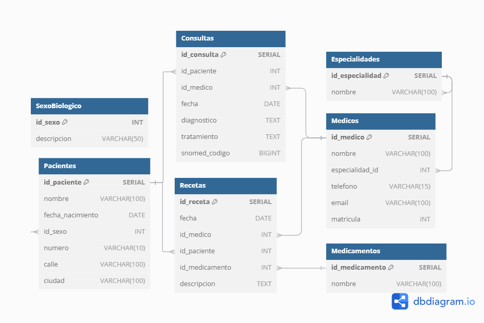

# Trabajo Práctico N°5


## _Autores:_ 
* Gonzalo Grau
* Agustín Luna Simondi

## **PARTE 1:** Bases de Datos

### 1. ¿Qué tipo de base de datos es? 

Respuesta : Para poder definir el tipo de base de datos primero debemos analizar el archivo y su formato.

Observando en detalle el archivo "base_de_datos.sql" podemos notar que los datos se almacenan de manera organizada en tablas . Estas tablas se dividen en columnas que indican las diferentes caracteristicas de los datos y en filas que acen alusion a los diferentes registros dentro de una misma tabla.

Además de esto se utilizan claves primarias (Primary Keys) y claves foraneas (Foriegn Keys). Por un lado las claves primarias garantinzan que cada registro en una tabla sea unico lo que asegura que no haya registro duplicados. Por otro lado la clave foranea permite crear relaciones entre las tablas. Por ejemplo en Pacientes, id_sexo es una clave foránea que se refiere a la tabla SexoBiologico. Esto ultimo es fundamental para poder establecer una relacion logica entre las 2 tablas

Dado a estar razones, podemos definir que el archivo se trata d euna base de datos relacional dado a que las tablas establecen relaciones logicas una con las otras asociandose segun diferentes caracteristicas al usar de manera combinada las claves primarias y las claves foraneas

### 2. Armar el diagrama entidad-relación de la base de datos dada. 


### 3. Armar el Modelo relacional de la base de datos dada.




### 4. Considera que la base de datos está normalizada. En caso que no lo esté, ¿cómo podría hacerlo?


En este caso debemos analizar las diferentes tablas que se armaron ya que vamos notar algunas que se encuentran correctamente normalizadas mientras que otras podrian necesitar mejoras.

Por ejemplo, en el caso de la tabla "SexoBiologico" se encuentra correctamente normalizada. Esto se debe a que por un lado tenemos que se delimita los generos usando un id_sexo como primary key y designando los terminos "Masculino" y "Femenino". A su vez , gracias a las relaciones de la base de datos, en la tabla "Pacientes" cada uno de los registros tiene un id_sexo como clave foránea. Esto es sumamente util para la normalizacion ya que se evitan redundacias de informacion al sexo biologico ya que otro usuario podria ingresarlo bajo otro termino como "Hombre" y "Mujer" o cualquier otro caso pueda posible. Esto mismo pasa en muchas otras tablas estableciendo relaciones, otro buen ejemplo es el caso de la tabla especialidades y la tabla médicos

Asimismo en la tabla de pacientes podemos encontrar ejemplos de atributos que necesitan de cierta normalización. Un claro caso de esto es el caso de ciudad en donde podemos ver varios registros que en esencia tienen el mismo valor de atributo pero al estar mal escrito (Bs Aires / buenos aires  / Buenos aires / etc) no se podrian analizar como el mismo valor. Al ser el atributo ciudad un valor el cual puede englobar a mas de uno paciente (algo que es mas dificil de hacer con datos puntuales como numero o fecha de nacimiento) se podria normalizar de la misma forma que se hace con id_sexo pero estableciendo esta vez un id_ciudad. A su vez , aunque no se encontraron errores, lo mismo ocurre para el caso de direcciones. En este caso tambien se podria usar un foreign key de id_direccion y seria una buena practica crear una tabla estas direcciones que se relacionan a su vez con un aclave foranea de id_ciudad ya que podria a ver una calle con el mismo nombre en ciudades diferentes. Estas relaciones permitirian un correcta normalizacion de estos atributos evitando errores de entradas y que los valores de estos atributos respeten una misma metodologia (lo que luego facilitara el uso de las herramientas de recoleccion de informacion como PowerBI)

Analizando el resto de tablas, otra tabla mas que quizas necesite de normalizacion es la del diagnostico en donde podria no normalizarse el atributo de diagnostico pero si el del codigo de Snomed. De esta manera más allá que el doctor pueda expresar un diagnostico en sus propias palabras , el id_snomed permitira una correcta normalización indicando un mismo diagnostico para todos.

## **PARTE 2:** Bases de Datos

### 1. Cuando se realizan consultas sobre la tabla paciente agrupando por ciudad los tiempos de respuesta son demasiado largos. Proponer mediante una query SQL una solución a este problema.

```sql
SELECT * FROM pacientes LIMIT 5
```
<div>
<style scoped>
    .dataframe tbody tr th:only-of-type {
        vertical-align: middle;
    }

    .dataframe tbody tr th {
        vertical-align: top;
    }

    .dataframe thead th {
        text-align: right;
    }
</style>
<table border="1" class="dataframe">
  <thead>
    <tr style="text-align: right;">
      <th></th>
      <th>nombre</th>
      <th>fecha_nacimiento</th>
      <th>id_sexo</th>
      <th>numero</th>
      <th>calle</th>
      <th>ciudad</th>
      <th>edad</th>
    </tr>
    <tr>
      <th>id_paciente</th>
      <th></th>
      <th></th>
      <th></th>
      <th></th>
      <th></th>
      <th></th>
      <th></th>
    </tr>
  </thead>
  <tbody>
    <tr>
      <th>1</th>
      <td>Luciana Gómez</td>
      <td>1991-07-12</td>
      <td>2</td>
      <td>121</td>
      <td>Avenida Las Heras</td>
      <td>Bs Aires</td>
      <td>33</td>
    </tr>
    <tr>
      <th>2</th>
      <td>Ricardo López</td>
      <td>1984-03-22</td>
      <td>1</td>
      <td>434</td>
      <td>Calle San Juan</td>
      <td>Rosario</td>
      <td>40</td>
    </tr>
    <tr>
      <th>3</th>
      <td>Clara Fernández</td>
      <td>1990-09-15</td>
      <td>2</td>
      <td>569</td>
      <td>Calle San Juan</td>
      <td>Rosario</td>
      <td>34</td>
    </tr>
    <tr>
      <th>4</th>
      <td>Marcos Ramírez</td>
      <td>1983-11-10</td>
      <td>1</td>
      <td>250</td>
      <td>Avenida Pellegrini</td>
      <td>Santa Fe</td>
      <td>40</td>
    </tr>
    <tr>
      <th>5</th>
      <td>Julieta Rodríguez</td>
      <td>1985-06-18</td>
      <td>2</td>
      <td>845</td>
      <td>Calle Mitre</td>
      <td>buenos aires</td>
      <td>39</td>
    </tr>
  </tbody>
</table>
</div>