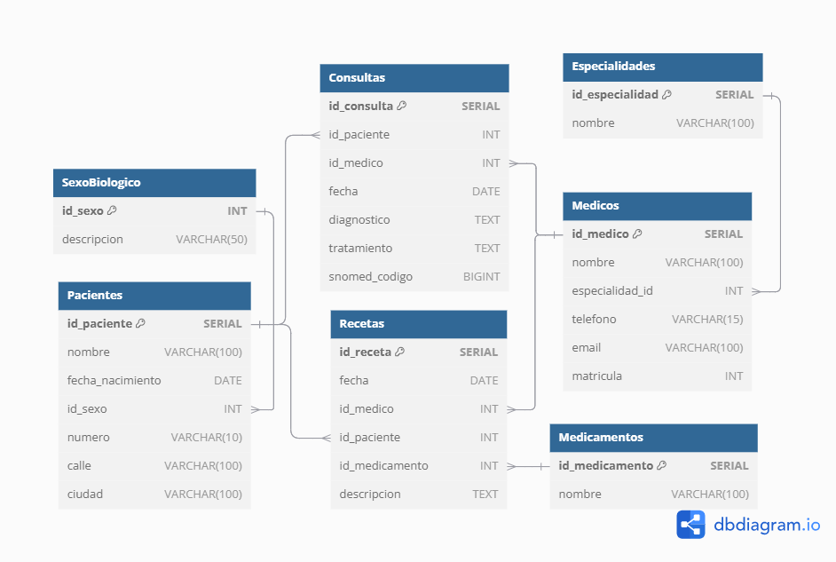

# Trabajo Práctico N°5


## _Autores:_ 
* Gonzalo Grau
* Agustín Luna Simondi

## **PARTE 1:** Bases de Datos

### 1. ¿Qué tipo de base de datos es? 

Respuesta : Para poder definir el tipo de base de datos primero debemos analizar el archivo y su formato.

Observando en detalle el archivo "base_de_datos.sql" podemos notar que los datos se almacenan de manera organizada en tablas . Estas tablas se dividen en columnas que indican las diferentes caracteristicas de los datos y en filas que acen alusion a los diferentes registros dentro de una misma tabla.

Además de esto se utilizan claves primarias (Primary Keys) y claves foraneas (Foriegn Keys). Por un lado las claves primarias garantinzan que cada registro en una tabla sea unico lo que asegura que no haya registro duplicados. Por otro lado la clave foranea permite crear relaciones entre las tablas. Por ejemplo en Pacientes, id_sexo es una clave foránea que se refiere a la tabla SexoBiologico. Esto ultimo es fundamental para poder establecer una relacion logica entre las 2 tablas

Dado a estar razones, podemos definir que el archivo se trata d euna base de datos relacional dado a que las tablas establecen relaciones logicas una con las otras asociandose segun diferentes caracteristicas al usar de manera combinada las claves primarias y las claves foraneas

### 2. Armar el diagrama entidad-relación de la base de datos dada. 


### 3. Armar el Modelo relacional de la base de datos dada.




### 4. Considera que la base de datos está normalizada. En caso que no lo esté, ¿cómo podría hacerlo?


En este caso debemos analizar las diferentes tablas que se armaron ya que vamos notar algunas que se encuentran correctamente normalizadas mientras que otras podrian necesitar mejoras.

Por ejemplo, en el caso de la tabla "SexoBiologico" se encuentra correctamente normalizada. Esto se debe a que por un lado tenemos que se delimita los generos usando un id_sexo como primary key y designando los terminos "Masculino" y "Femenino". A su vez , gracias a las relaciones de la base de datos, en la tabla "Pacientes" cada uno de los registros tiene un id_sexo como clave foránea. Esto es sumamente util para la normalizacion ya que se evitan redundacias de informacion al sexo biologico ya que otro usuario podria ingresarlo bajo otro termino como "Hombre" y "Mujer" o cualquier otro caso pueda posible. Esto mismo pasa en muchas otras tablas estableciendo relaciones, otro buen ejemplo es el caso de la tabla especialidades y la tabla médicos.

Asimismo en la tabla de pacientes podemos encontrar ejemplos de atributos que necesitan de cierta normalización. Un claro caso de esto es el caso de ciudad en donde podemos ver varios registros que en esencia tienen el mismo valor de atributo pero al estar mal escrito (Bs Aires / buenos aires  / Buenos aires / etc) no se podrian analizar como el mismo valor. Al ser el atributo ciudad un valor el cual puede englobar a mas de uno paciente (algo que es mas dificil de hacer con datos puntuales como numero o fecha de nacimiento) se podria normalizar de la misma forma que se hace con id_sexo pero estableciendo esta vez un id_ciudad. A su vez , aunque no se encontraron errores, lo mismo ocurre para el caso de direcciones. En este caso tambien se podria usar un foreign key de id_direccion y seria una buena practica crear una tabla estas direcciones que se relacionan a su vez con un aclave foranea de id_ciudad ya que podria a ver una calle con el mismo nombre en ciudades diferentes. Estas relaciones permitirian un correcta normalizacion de estos atributos evitando errores de entradas y que los valores de estos atributos respeten una misma metodologia (lo que luego facilitara el uso de las herramientas de recoleccion de informacion como PowerBI).

Analizando el resto de tablas, otra tabla mas que quizas necesite de normalizacion es la del diagnostico en donde podria no normalizarse el atributo de diagnostico pero si el del codigo de Snomed. De esta manera más allá que el doctor pueda expresar un diagnostico en sus propias palabras , el id_snomed permitira una correcta normalización indicando un mismo diagnostico para todos.

## **PARTE 2:** Bases de Datos

**1. Cuando se realizan consultas sobre la tabla paciente agrupando por ciudad los tiempos de respuesta son demasiado largos. Proponer mediante una query SQL una solución a este problema.**

```sql
CREATE INDEX IF NOT EXISTS idx_ciudades 
  ON pacientes (ciudad);
```

**2. Se tiene la fecha de nacimiento de los pacientes. Se desea calcular la edad de los pacientes y almacenarla de forma dinámica en el sistema ya que es un valor típicamente consultado junto con otra información relevante del paciente.**

```sql
ALTER TABLE pacientes
  ADD COLUMN IF NOT EXISTS edad INT;

UPDATE pacientes
  SET edad = EXTRACT(YEAR FROM AGE(CURRENT_DATE, fecha_nacimiento));
```

**3. La paciente, “Luciana Gómez”, ha cambiado de dirección. Antes vivía en “Avenida Las Heras 121” en “Buenos Aires”, pero ahora vive en “Calle Corrientes 500” en “Buenos Aires”. Actualizar la dirección de este paciente en la base de datos.**

```sql
UPDATE pacientes
  SET calle = 'Calle Corrientes', numero = 500
  WHERE nombre = 'Luciana Gómez';
```

**4. Seleccionar el nombre y la matrícula de cada médico cuya especialidad sea identificada por el id 4.**

```sql
SELECT m.nombre, m.matricula, e.nombre
  FROM medicos m JOIN especialidades e
  ON m.especialidad_id = e.id_especialidad
  WHERE e.id_especialidad = 4;
```

<div>
<style scoped>
    .dataframe tbody tr th:only-of-type {
        vertical-align: middle;
    }

    .dataframe tbody tr th {
        vertical-align: top;
    }

    .dataframe thead th {
        text-align: right;
    }
</style>
<table border="1" class="dataframe">
  <thead>
    <tr style="text-align: right;">
      <th></th>
      <th>nombre</th>
      <th>matricula</th>
      <th>nombre</th>
    </tr>
  </thead>
  <tbody>
    <tr>
      <th>0</th>
      <td>Dra. Lucía Rodríguez</td>
      <td>89012</td>
      <td>Dermatología</td>
    </tr>
    <tr>
      <th>1</th>
      <td>Dr. Nicolás Gutiérrez</td>
      <td>90123</td>
      <td>Dermatología</td>
    </tr>
  </tbody>
</table>
</div>

**5. Puede pasar que haya inconsistencias en la forma en la que están escritos los nombres de las ciudades, ¿cómo se corrige esto? Agregar la query correspondiente.**

```sql
CREATE EXTENSION IF NOT EXISTS pg_trgm;

UPDATE pacientes
  SET ciudad = 'Buenos Aires'
  WHERE similarity(ciudad, 'Buenos Aires') > 0.3;

UPDATE pacientes
  SET ciudad = 'Rosario'
  WHERE similarity(ciudad, 'Rosario') > 0.3;

UPDATE pacientes
  SET ciudad = 'Sante Fé'
  WHERE similarity(ciudad, 'Sante Fé') > 0.3;

UPDATE pacientes
  SET ciudad = 'Córdoba'
  WHERE similarity(ciudad, 'Córdoba') > 0.3;

UPDATE pacientes
  SET ciudad = 'Mendoza'
  WHERE similarity(ciudad, 'Mendoza') > 0.3;
```

**6. Obtener el nombre y la dirección de los pacientes que viven en Buenos Aires.**

```sql
SELECT nombre, calle || ' ' || numero AS direccion
  FROM pacientes
  WHERE ciudad = 'Buenos Aires';
```

<div>
<style scoped>
    .dataframe tbody tr th:only-of-type {
        vertical-align: middle;
    }

    .dataframe tbody tr th {
        vertical-align: top;
    }

    .dataframe thead th {
        text-align: right;
    }
</style>
<table border="1" class="dataframe">
  <thead>
    <tr style="text-align: right;">
      <th></th>
      <th>nombre</th>
      <th>direccion</th>
    </tr>
  </thead>
  <tbody>
    <tr>
      <th>0</th>
      <td>Luciana Gómez</td>
      <td>Calle Corrientes 500</td>
    </tr>
    <tr>
      <th>1</th>
      <td>Julieta Rodríguez</td>
      <td>Calle Mitre 845</td>
    </tr>
    <tr>
      <th>2</th>
      <td>Santiago Pérez</td>
      <td>Calle Balcarce 1103</td>
    </tr>
    <tr>
      <th>3</th>
      <td>Micaela Gutiérrez</td>
      <td>Avenida Sarmiento 776</td>
    </tr>
    <tr>
      <th>4</th>
      <td>Nicolás Morales</td>
      <td>Calle Rivadavia 923</td>
    </tr>
    <tr>
      <th>5</th>
      <td>Carolina Figueroa</td>
      <td>Calle Rivadavia 135</td>
    </tr>
    <tr>
      <th>6</th>
      <td>Agustín Romero</td>
      <td>Calle 25 de Mayo 853</td>
    </tr>
    <tr>
      <th>7</th>
      <td>Sofía Maldonado</td>
      <td>Avenida Libertador 492</td>
    </tr>
  </tbody>
</table>
</div>

**7. Cantidad de pacientes que viven en cada ciudad.**

```sql
SELECT ciudad, COUNT(*) AS cantidad
  FROM pacientes
  GROUP BY ciudad
  ORDER BY cantidad DESC;
```

<div>
<style scoped>
    .dataframe tbody tr th:only-of-type {
        vertical-align: middle;
    }

    .dataframe tbody tr th {
        vertical-align: top;
    }

    .dataframe thead th {
        text-align: right;
    }
</style>
<table border="1" class="dataframe">
  <thead>
    <tr style="text-align: right;">
      <th></th>
      <th>nombre</th>
      <th>direccion</th>
    </tr>
  </thead>
  <tbody>
    <tr>
      <th>0</th>
      <td>Luciana Gómez</td>
      <td>Calle Corrientes 500</td>
    </tr>
    <tr>
      <th>1</th>
      <td>Julieta Rodríguez</td>
      <td>Calle Mitre 845</td>
    </tr>
    <tr>
      <th>2</th>
      <td>Santiago Pérez</td>
      <td>Calle Balcarce 1103</td>
    </tr>
    <tr>
      <th>3</th>
      <td>Micaela Gutiérrez</td>
      <td>Avenida Sarmiento 776</td>
    </tr>
    <tr>
      <th>4</th>
      <td>Nicolás Morales</td>
      <td>Calle Rivadavia 923</td>
    </tr>
    <tr>
      <th>5</th>
      <td>Carolina Figueroa</td>
      <td>Calle Rivadavia 135</td>
    </tr>
    <tr>
      <th>6</th>
      <td>Agustín Romero</td>
      <td>Calle 25 de Mayo 853</td>
    </tr>
    <tr>
      <th>7</th>
      <td>Sofía Maldonado</td>
      <td>Avenida Libertador 492</td>
    </tr>
  </tbody>
</table>
</div>

**8 Cantidad de pacientes por sexo que viven en cada ciudad.** 

```sql
SELECT ciudad, descripcion, COUNT(*) AS cantidad
  FROM pacientes JOIN sexobiologico
  ON pacientes.id_sexo = sexobiologico.id_sexo
  GROUP BY ciudad, descripcion;
```

<div>
<style scoped>
    .dataframe tbody tr th:only-of-type {
        vertical-align: middle;
    }

    .dataframe tbody tr th {
        vertical-align: top;
    }

    .dataframe thead th {
        text-align: right;
    }
</style>
<table border="1" class="dataframe">
  <thead>
    <tr style="text-align: right;">
      <th></th>
      <th>ciudad</th>
      <th>cantidad</th>
    </tr>
  </thead>
  <tbody>
    <tr>
      <th>0</th>
      <td>Buenos Aires</td>
      <td>8</td>
    </tr>
    <tr>
      <th>1</th>
      <td>Córdoba</td>
      <td>6</td>
    </tr>
    <tr>
      <th>2</th>
      <td>Mendoza</td>
      <td>4</td>
    </tr>
    <tr>
      <th>3</th>
      <td>Rosario</td>
      <td>4</td>
    </tr>
    <tr>
      <th>4</th>
      <td>Sante Fé</td>
      <td>1</td>
    </tr>
  </tbody>
</table>
</div>

**9. Obtener la cantidad de recetas emitidas por cada médico** 

```sql
SELECT m.id_medico, nombre, COUNT(id_receta) AS cantidad
  FROM medicos m LEFT JOIN recetas
  ON m.id_medico = recetas.id_medico
  GROUP BY m.id_medico, nombre
  ORDER BY cantidad DESC;
```

<div>
<style scoped>
    .dataframe tbody tr th:only-of-type {
        vertical-align: middle;
    }

    .dataframe tbody tr th {
        vertical-align: top;
    }

    .dataframe thead th {
        text-align: right;
    }
</style>
<table border="1" class="dataframe">
  <thead>
    <tr style="text-align: right;">
      <th></th>
      <th>nombre</th>
      <th>cantidad</th>
    </tr>
    <tr>
      <th>id_medico</th>
      <th></th>
      <th></th>
    </tr>
  </thead>
  <tbody>
    <tr>
      <th>9</th>
      <td>Dr. Nicolás Gutiérrez</td>
      <td>6</td>
    </tr>
    <tr>
      <th>8</th>
      <td>Dra. Lucía Rodríguez</td>
      <td>5</td>
    </tr>
    <tr>
      <th>2</th>
      <td>Dra. Laura Fernández</td>
      <td>4</td>
    </tr>
    <tr>
      <th>10</th>
      <td>Dra. Mónica Silva</td>
      <td>3</td>
    </tr>
    <tr>
      <th>7</th>
      <td>Dra. Carolina Méndez</td>
      <td>3</td>
    </tr>
    <tr>
      <th>1</th>
      <td>Dr. Carlos García</td>
      <td>3</td>
    </tr>
    <tr>
      <th>3</th>
      <td>Dr. Pedro Ruiz</td>
      <td>3</td>
    </tr>
    <tr>
      <th>4</th>
      <td>Dra. Gabriela Fernández</td>
      <td>3</td>
    </tr>
    <tr>
      <th>12</th>
      <td>Dra. Valentina López</td>
      <td>0</td>
    </tr>
    <tr>
      <th>18</th>
      <td>Dr. Juan Muñoz</td>
      <td>0</td>
    </tr>
    <tr>
      <th>14</th>
      <td>Dra. Alicia Ramírez</td>
      <td>0</td>
    </tr>
    <tr>
      <th>15</th>
      <td>Dr. Mateo González</td>
      <td>0</td>
    </tr>
    <tr>
      <th>17</th>
      <td>Dr. Pablo Martínez</td>
      <td>0</td>
    </tr>
    <tr>
      <th>5</th>
      <td>Dr. José Álvarez</td>
      <td>0</td>
    </tr>
    <tr>
      <th>6</th>
      <td>Dr. Martín Sánchez</td>
      <td>0</td>
    </tr>
    <tr>
      <th>11</th>
      <td>Dr. Andrés Vázquez</td>
      <td>0</td>
    </tr>
    <tr>
      <th>13</th>
      <td>Dr. Sebastián Pérez</td>
      <td>0</td>
    </tr>
    <tr>
      <th>16</th>
      <td>Dra. Marta Ávila</td>
      <td>0</td>
    </tr>
  </tbody>
</table>
</div>

**10. Obtener todas las conultas médicas realizadas por el médico con ID igual a 3 en el mes de agosto de 2024** 

```sql
SELECT *
  FROM consultas
  WHERE id_medico = 3
  AND EXTRACT(MONTH FROM DATE(fecha)) = 8
  AND EXTRACT(YEAR FROM DATE(fecha)) = 2024;
```

<div>
<style scoped>
    .dataframe tbody tr th:only-of-type {
        vertical-align: middle;
    }

    .dataframe tbody tr th {
        vertical-align: top;
    }

    .dataframe thead th {
        text-align: right;
    }
</style>
<table border="1" class="dataframe">
  <thead>
    <tr style="text-align: right;">
      <th></th>
      <th>id_paciente</th>
      <th>id_medico</th>
      <th>fecha</th>
      <th>diagnostico</th>
      <th>tratamiento</th>
      <th>snomed_codigo</th>
    </tr>
    <tr>
      <th>id_consulta</th>
      <th></th>
      <th></th>
      <th></th>
      <th></th>
      <th></th>
      <th></th>
    </tr>
  </thead>
  <tbody>
    <tr>
      <th>24</th>
      <td>16</td>
      <td>3</td>
      <td>2024-08-08</td>
      <td>Dolor de pecho</td>
      <td>None</td>
      <td>29857009</td>
    </tr>
    <tr>
      <th>32</th>
      <td>18</td>
      <td>3</td>
      <td>2024-08-16</td>
      <td>Hipertensión arterial</td>
      <td>None</td>
      <td>59621000</td>
    </tr>
    <tr>
      <th>45</th>
      <td>5</td>
      <td>3</td>
      <td>2024-08-29</td>
      <td>Dolor de pecho</td>
      <td>None</td>
      <td>29857009</td>
    </tr>
  </tbody>
</table>
</div>

**11. Obtener el nombre de los pacientes junto con la fecha y el diagnóstico de todas las consultas médicas realizadas en agosto del 2024.**

```sql
SELECT c.id_consulta, p.nombre, c.fecha, c.diagnostico
  FROM consultas c JOIN pacientes p
  ON c.id_paciente = p.id_paciente
  WHERE EXTRACT(MONTH FROM DATE(fecha)) = 8
  AND EXTRACT(YEAR FROM DATE(fecha)) = 2024;
```

<div>
<style scoped>
    .dataframe tbody tr th:only-of-type {
        vertical-align: middle;
    }

    .dataframe tbody tr th {
        vertical-align: top;
    }

    .dataframe thead th {
        text-align: right;
    }
</style>
<table border="1" class="dataframe">
  <thead>
    <tr style="text-align: right;">
      <th></th>
      <th>nombre</th>
      <th>fecha</th>
      <th>diagnostico</th>
    </tr>
    <tr>
      <th>id_consulta</th>
      <th></th>
      <th></th>
      <th></th>
    </tr>
  </thead>
  <tbody>
    <tr>
      <th>17</th>
      <td>Esteban Muñoz</td>
      <td>2024-08-01</td>
      <td>Bronquitis</td>
    </tr>
    <tr>
      <th>18</th>
      <td>María Luisa Torres</td>
      <td>2024-08-02</td>
      <td>Luxación de hombro</td>
    </tr>
    <tr>
      <th>19</th>
      <td>Sofía Maldonado</td>
      <td>2024-08-03</td>
      <td>Sinusitis</td>
    </tr>
    <tr>
      <th>20</th>
      <td>Juan Pérez</td>
      <td>2024-08-04</td>
      <td>Fractura de pierna</td>
    </tr>
    <tr>
      <th>21</th>
      <td>Agustín Romero</td>
      <td>2024-08-05</td>
      <td>Ansiedad</td>
    </tr>
    <tr>
      <th>22</th>
      <td>Florencia Álvarez</td>
      <td>2024-08-06</td>
      <td>Luxación de hombro</td>
    </tr>
    <tr>
      <th>23</th>
      <td>Gabriela Vázquez</td>
      <td>2024-08-07</td>
      <td>Eccema</td>
    </tr>
    <tr>
      <th>24</th>
      <td>Gustavo Suárez</td>
      <td>2024-08-08</td>
      <td>Dolor de pecho</td>
    </tr>
    <tr>
      <th>25</th>
      <td>Clara Fernández</td>
      <td>2024-08-09</td>
      <td>Gastritis</td>
    </tr>
    <tr>
      <th>26</th>
      <td>Joaquín Castillo</td>
      <td>2024-08-10</td>
      <td>Asma crónico</td>
    </tr>
    <tr>
      <th>27</th>
      <td>Nicolás Morales</td>
      <td>2024-08-11</td>
      <td>Infección de oído</td>
    </tr>
    <tr>
      <th>28</th>
      <td>Carolina Figueroa</td>
      <td>2024-08-12</td>
      <td>Fractura de muñeca</td>
    </tr>
    <tr>
      <th>29</th>
      <td>Paula Medina</td>
      <td>2024-08-13</td>
      <td>Trastorno bipolar</td>
    </tr>
    <tr>
      <th>30</th>
      <td>Marcos Ramírez</td>
      <td>2024-08-14</td>
      <td>Degeneración macular</td>
    </tr>
    <tr>
      <th>31</th>
      <td>Julieta Rodríguez</td>
      <td>2024-08-15</td>
      <td>Problemas de visión</td>
    </tr>
    <tr>
      <th>32</th>
      <td>Agustín Romero</td>
      <td>2024-08-16</td>
      <td>Hipertensión arterial</td>
    </tr>
    <tr>
      <th>33</th>
      <td>Fernando García</td>
      <td>2024-08-17</td>
      <td>Trastorno obsesivo-compulsivo</td>
    </tr>
    <tr>
      <th>34</th>
      <td>Clara Fernández</td>
      <td>2024-08-18</td>
      <td>Fractura de tobillo</td>
    </tr>
    <tr>
      <th>35</th>
      <td>Facundo Paredes</td>
      <td>2024-08-19</td>
      <td>Depresión severa</td>
    </tr>
    <tr>
      <th>36</th>
      <td>Gabriela Vázquez</td>
      <td>2024-08-20</td>
      <td>Psoriasis</td>
    </tr>
    <tr>
      <th>37</th>
      <td>Carolina Figueroa</td>
      <td>2024-08-21</td>
      <td>Trastorno bipolar</td>
    </tr>
    <tr>
      <th>38</th>
      <td>Joaquín Castillo</td>
      <td>2024-08-22</td>
      <td>Luxación de codo</td>
    </tr>
    <tr>
      <th>39</th>
      <td>Santiago Pérez</td>
      <td>2024-08-23</td>
      <td>Bronquitis crónica</td>
    </tr>
    <tr>
      <th>40</th>
      <td>María Luisa Torres</td>
      <td>2024-08-24</td>
      <td>Gastritis crónica</td>
    </tr>
    <tr>
      <th>41</th>
      <td>Sofía Maldonado</td>
      <td>2024-08-25</td>
      <td>Ansiedad generalizada</td>
    </tr>
    <tr>
      <th>42</th>
      <td>Juan Pérez</td>
      <td>2024-08-26</td>
      <td>Dermatitis atópica</td>
    </tr>
    <tr>
      <th>43</th>
      <td>Micaela Gutiérrez</td>
      <td>2024-08-27</td>
      <td>Trastorno de pánico</td>
    </tr>
    <tr>
      <th>44</th>
      <td>Gustavo Suárez</td>
      <td>2024-08-28</td>
      <td>Cataratas</td>
    </tr>
    <tr>
      <th>45</th>
      <td>Julieta Rodríguez</td>
      <td>2024-08-29</td>
      <td>Dolor de pecho</td>
    </tr>
    <tr>
      <th>46</th>
      <td>Agustín Romero</td>
      <td>2024-08-30</td>
      <td>Fractura de fémur</td>
    </tr>
    <tr>
      <th>47</th>
      <td>Ricardo López</td>
      <td>2024-08-31</td>
      <td>Infección de oído crónica</td>
    </tr>
  </tbody>
</table>
</div>

**12. Obtener el nombre de los medicamentos prescritos más de una vez por el médico con ID igual a 2.**

```sql
SELECT m.nombre, r.id_medico, COUNT(r.id_receta)
  FROM medicamentos m JOIN recetas r 
  ON r.id_medicamento = m.id_medicamento
  WHERE r.id_medico = 2
  GROUP BY m.nombre, r.id_medico
  HAVING COUNT(r.id_receta) > 1;
```

<div>
<style scoped>
    .dataframe tbody tr th:only-of-type {
        vertical-align: middle;
    }

    .dataframe tbody tr th {
        vertical-align: top;
    }

    .dataframe thead th {
        text-align: right;
    }
</style>
<table border="1" class="dataframe">
  <thead>
    <tr style="text-align: right;">
      <th></th>
      <th>nombre</th>
      <th>id_medico</th>
      <th>count</th>
    </tr>
  </thead>
  <tbody>
    <tr>
      <th>0</th>
      <td>Omeprazol</td>
      <td>2</td>
      <td>2</td>
    </tr>
  </tbody>
</table>
</div>

**13. Obtener el nombre de los pacientes junto con la cantidad total de recetas que han recibido.**

```sql
SELECT p.id_paciente, p.nombre, COUNT(r.id_receta) as cant_recetas
  FROM pacientes p JOIN recetas r 
  ON p.id_paciente = r.id_paciente
  GROUP BY p.id_paciente, p.nombre;
```

<div>
<style scoped>
    .dataframe tbody tr th:only-of-type {
        vertical-align: middle;
    }

    .dataframe tbody tr th {
        vertical-align: top;
    }

    .dataframe thead th {
        text-align: right;
    }
</style>
<table border="1" class="dataframe">
  <thead>
    <tr style="text-align: right;">
      <th></th>
      <th>nombre</th>
      <th>cant_recetas</th>
    </tr>
    <tr>
      <th>id_paciente</th>
      <th></th>
      <th></th>
    </tr>
  </thead>
  <tbody>
    <tr>
      <th>8</th>
      <td>Esteban Muñoz</td>
      <td>1</td>
    </tr>
    <tr>
      <th>11</th>
      <td>María Luisa Torres</td>
      <td>2</td>
    </tr>
    <tr>
      <th>19</th>
      <td>Sofía Maldonado</td>
      <td>2</td>
    </tr>
    <tr>
      <th>4</th>
      <td>Marcos Ramírez</td>
      <td>2</td>
    </tr>
    <tr>
      <th>21</th>
      <td>Claudia Rojas</td>
      <td>1</td>
    </tr>
    <tr>
      <th>14</th>
      <td>Nicolás Morales</td>
      <td>2</td>
    </tr>
    <tr>
      <th>3</th>
      <td>Clara Fernández</td>
      <td>1</td>
    </tr>
    <tr>
      <th>17</th>
      <td>Paula Medina</td>
      <td>2</td>
    </tr>
    <tr>
      <th>22</th>
      <td>Juan Pérez</td>
      <td>1</td>
    </tr>
    <tr>
      <th>20</th>
      <td>Facundo Paredes</td>
      <td>1</td>
    </tr>
    <tr>
      <th>10</th>
      <td>Fernando García</td>
      <td>1</td>
    </tr>
    <tr>
      <th>13</th>
      <td>Micaela Gutiérrez</td>
      <td>1</td>
    </tr>
    <tr>
      <th>9</th>
      <td>Gabriela Vázquez</td>
      <td>2</td>
    </tr>
    <tr>
      <th>7</th>
      <td>Florencia Álvarez</td>
      <td>2</td>
    </tr>
    <tr>
      <th>5</th>
      <td>Julieta Rodríguez</td>
      <td>1</td>
    </tr>
    <tr>
      <th>18</th>
      <td>Agustín Romero</td>
      <td>1</td>
    </tr>
    <tr>
      <th>2</th>
      <td>Ricardo López</td>
      <td>1</td>
    </tr>
    <tr>
      <th>16</th>
      <td>Gustavo Suárez</td>
      <td>1</td>
    </tr>
    <tr>
      <th>15</th>
      <td>Carolina Figueroa</td>
      <td>2</td>
    </tr>
    <tr>
      <th>6</th>
      <td>Santiago Pérez</td>
      <td>1</td>
    </tr>
    <tr>
      <th>12</th>
      <td>Joaquín Castillo</td>
      <td>2</td>
    </tr>
  </tbody>
</table>
</div>

**14. Obtener el nombre del medicamento más recetado junto con la cantidad de recetas emitidas para ese medicamento.**

```sql
SELECT p.nombre, MAX(c.fecha) AS ultima_consulta, c.diagnostico
  FROM pacientes p
  JOIN consultas c ON p.id_paciente = c.id_paciente
  GROUP BY p.nombre, c.diagnostico;
```

<div>
<style scoped>
    .dataframe tbody tr th:only-of-type {
        vertical-align: middle;
    }

    .dataframe tbody tr th {
        vertical-align: top;
    }

    .dataframe thead th {
        text-align: right;
    }
</style>
<table border="1" class="dataframe">
  <thead>
    <tr style="text-align: right;">
      <th></th>
      <th>nombre</th>
      <th>total_recetas</th>
    </tr>
  </thead>
  <tbody>
    <tr>
      <th>0</th>
      <td>Férula</td>
      <td>4</td>
    </tr>
  </tbody>
</table>
</div>

**15. Obtener el nombre del paciente junto con la fecha de su última consulta y el diagnóstico asociado.**

```sql
CREATE VIEW ultima_consulta AS
  SELECT p.nombre, MAX(c.fecha) AS ultima_consulta, c.diagnostico
  FROM pacientes p
  JOIN consultas c ON p.id_paciente = c.id_paciente
  GROUP BY p.nombre, c.diagnostico;
```

<div>
<style scoped>
    .dataframe tbody tr th:only-of-type {
        vertical-align: middle;
    }

    .dataframe tbody tr th {
        vertical-align: top;
    }

    .dataframe thead th {
        text-align: right;
    }
</style>
<table border="1" class="dataframe">
  <thead>
    <tr style="text-align: right;">
      <th></th>
      <th>ultima_consulta</th>
      <th>diagnostico</th>
    </tr>
    <tr>
      <th>nombre</th>
      <th></th>
      <th></th>
    </tr>
  </thead>
  <tbody>
    <tr>
      <th>Nicolás Morales</th>
      <td>2024-07-28</td>
      <td>Acné severo</td>
    </tr>
    <tr>
      <th>Fernando García</th>
      <td>2024-08-17</td>
      <td>Trastorno obsesivo-compulsivo</td>
    </tr>
    <tr>
      <th>Gabriela Vázquez</th>
      <td>2024-08-07</td>
      <td>Eccema</td>
    </tr>
    <tr>
      <th>Gabriela Vázquez</th>
      <td>2024-07-13</td>
      <td>Glaucoma</td>
    </tr>
    <tr>
      <th>Sofía Maldonado</th>
      <td>2024-08-25</td>
      <td>Ansiedad generalizada</td>
    </tr>
    <tr>
      <th>...</th>
      <td>...</td>
      <td>...</td>
    </tr>
    <tr>
      <th>Joaquín Castillo</th>
      <td>2024-07-06</td>
      <td>Acné</td>
    </tr>
    <tr>
      <th>María Luisa Torres</th>
      <td>2024-07-15</td>
      <td>Depresión</td>
    </tr>
    <tr>
      <th>Juan Pérez</th>
      <td>2024-08-26</td>
      <td>Dermatitis atópica</td>
    </tr>
    <tr>
      <th>Agustín Romero</th>
      <td>2024-08-16</td>
      <td>Hipertensión arterial</td>
    </tr>
    <tr>
      <th>Agustín Romero</th>
      <td>2024-08-05</td>
      <td>Ansiedad</td>
    </tr>
  </tbody>
</table>
<p>61 rows × 2 columns</p>
</div>

**16. Obtener el nombre del médico junto con el nombre del paciente y el número total de consultas realizadas por cada médico para cada paciente, ordenado por médico y paciente  .** 

```sql
SELECT m.nombre AS nombre_medico, p.nombre AS nombre_paciente, COUNT(*) AS total_consultas
  FROM Consultas c
  JOIN Medicos m ON c.id_medico = m.id_medico
  JOIN Pacientes p ON c.id_paciente = p.id_paciente
  GROUP BY m.nombre, p.nombre
  ORDER BY m.nombre, p.nombre;
```

<div>
<style scoped>
    .dataframe tbody tr th:only-of-type {
        vertical-align: middle;
    }

    .dataframe tbody tr th {
        vertical-align: top;
    }

    .dataframe thead th {
        text-align: right;
    }
</style>
<table border="1" class="dataframe">
  <thead>
    <tr style="text-align: right;">
      <th></th>
      <th>nombre_medico</th>
      <th>nombre_paciente</th>
      <th>total_consultas</th>
    </tr>
  </thead>
  <tbody>
    <tr>
      <th>0</th>
      <td>Dra. Carolina Méndez</td>
      <td>Carolina Figueroa</td>
      <td>1</td>
    </tr>
    <tr>
      <th>1</th>
      <td>Dra. Carolina Méndez</td>
      <td>Facundo Paredes</td>
      <td>1</td>
    </tr>
    <tr>
      <th>2</th>
      <td>Dra. Carolina Méndez</td>
      <td>Gabriela Vázquez</td>
      <td>1</td>
    </tr>
    <tr>
      <th>3</th>
      <td>Dra. Carolina Méndez</td>
      <td>Gustavo Suárez</td>
      <td>1</td>
    </tr>
    <tr>
      <th>4</th>
      <td>Dra. Carolina Méndez</td>
      <td>Julieta Rodríguez</td>
      <td>1</td>
    </tr>
    <tr>
      <th>5</th>
      <td>Dra. Carolina Méndez</td>
      <td>Marcos Ramírez</td>
      <td>1</td>
    </tr>
    <tr>
      <th>6</th>
      <td>Dra. Gabriela Fernández</td>
      <td>Gabriela Vázquez</td>
      <td>3</td>
    </tr>
    <tr>
      <th>7</th>
      <td>Dra. Gabriela Fernández</td>
      <td>Joaquín Castillo</td>
      <td>1</td>
    </tr>
    <tr>
      <th>8</th>
      <td>Dra. Gabriela Fernández</td>
      <td>Juan Pérez</td>
      <td>2</td>
    </tr>
    <tr>
      <th>9</th>
      <td>Dra. Gabriela Fernández</td>
      <td>Nicolás Morales</td>
      <td>1</td>
    </tr>
    <tr>
      <th>10</th>
      <td>Dra. Laura Fernández</td>
      <td>Carolina Figueroa</td>
      <td>1</td>
    </tr>
    <tr>
      <th>11</th>
      <td>Dra. Laura Fernández</td>
      <td>Clara Fernández</td>
      <td>2</td>
    </tr>
    <tr>
      <th>12</th>
      <td>Dra. Laura Fernández</td>
      <td>Esteban Muñoz</td>
      <td>1</td>
    </tr>
    <tr>
      <th>13</th>
      <td>Dra. Laura Fernández</td>
      <td>Fernando García</td>
      <td>1</td>
    </tr>
    <tr>
      <th>14</th>
      <td>Dra. Laura Fernández</td>
      <td>Julieta Rodríguez</td>
      <td>1</td>
    </tr>
    <tr>
      <th>15</th>
      <td>Dra. Laura Fernández</td>
      <td>María Luisa Torres</td>
      <td>1</td>
    </tr>
    <tr>
      <th>16</th>
      <td>Dra. Laura Fernández</td>
      <td>Sofía Maldonado</td>
      <td>1</td>
    </tr>
    <tr>
      <th>17</th>
      <td>Dra. Lucía Rodríguez</td>
      <td>Agustín Romero</td>
      <td>1</td>
    </tr>
    <tr>
      <th>18</th>
      <td>Dra. Lucía Rodríguez</td>
      <td>Carolina Figueroa</td>
      <td>1</td>
    </tr>
    <tr>
      <th>19</th>
      <td>Dra. Lucía Rodríguez</td>
      <td>Claudia Rojas</td>
      <td>1</td>
    </tr>
    <tr>
      <th>20</th>
      <td>Dra. Lucía Rodríguez</td>
      <td>Facundo Paredes</td>
      <td>1</td>
    </tr>
    <tr>
      <th>21</th>
      <td>Dra. Lucía Rodríguez</td>
      <td>Fernando García</td>
      <td>1</td>
    </tr>
    <tr>
      <th>22</th>
      <td>Dra. Lucía Rodríguez</td>
      <td>Julieta Rodríguez</td>
      <td>1</td>
    </tr>
    <tr>
      <th>23</th>
      <td>Dra. Lucía Rodríguez</td>
      <td>María Luisa Torres</td>
      <td>2</td>
    </tr>
    <tr>
      <th>24</th>
      <td>Dra. Lucía Rodríguez</td>
      <td>Micaela Gutiérrez</td>
      <td>1</td>
    </tr>
    <tr>
      <th>25</th>
      <td>Dra. Lucía Rodríguez</td>
      <td>Paula Medina</td>
      <td>3</td>
    </tr>
    <tr>
      <th>26</th>
      <td>Dra. Lucía Rodríguez</td>
      <td>Santiago Pérez</td>
      <td>1</td>
    </tr>
    <tr>
      <th>27</th>
      <td>Dra. Lucía Rodríguez</td>
      <td>Sofía Maldonado</td>
      <td>1</td>
    </tr>
    <tr>
      <th>28</th>
      <td>Dra. Mónica Silva</td>
      <td>Micaela Gutiérrez</td>
      <td>1</td>
    </tr>
    <tr>
      <th>29</th>
      <td>Dra. Mónica Silva</td>
      <td>Nicolás Morales</td>
      <td>1</td>
    </tr>
    <tr>
      <th>30</th>
      <td>Dra. Mónica Silva</td>
      <td>Ricardo López</td>
      <td>1</td>
    </tr>
    <tr>
      <th>31</th>
      <td>Dra. Mónica Silva</td>
      <td>Sofía Maldonado</td>
      <td>1</td>
    </tr>
    <tr>
      <th>32</th>
      <td>Dr. Carlos García</td>
      <td>Agustín Romero</td>
      <td>1</td>
    </tr>
    <tr>
      <th>33</th>
      <td>Dr. Carlos García</td>
      <td>Esteban Muñoz</td>
      <td>1</td>
    </tr>
    <tr>
      <th>34</th>
      <td>Dr. Carlos García</td>
      <td>Florencia Álvarez</td>
      <td>2</td>
    </tr>
    <tr>
      <th>35</th>
      <td>Dr. Carlos García</td>
      <td>Joaquín Castillo</td>
      <td>1</td>
    </tr>
    <tr>
      <th>36</th>
      <td>Dr. Carlos García</td>
      <td>Santiago Pérez</td>
      <td>1</td>
    </tr>
    <tr>
      <th>37</th>
      <td>Dr. Nicolás Gutiérrez</td>
      <td>Agustín Romero</td>
      <td>1</td>
    </tr>
    <tr>
      <th>38</th>
      <td>Dr. Nicolás Gutiérrez</td>
      <td>Carolina Figueroa</td>
      <td>1</td>
    </tr>
    <tr>
      <th>39</th>
      <td>Dr. Nicolás Gutiérrez</td>
      <td>Clara Fernández</td>
      <td>1</td>
    </tr>
    <tr>
      <th>40</th>
      <td>Dr. Nicolás Gutiérrez</td>
      <td>Facundo Paredes</td>
      <td>1</td>
    </tr>
    <tr>
      <th>41</th>
      <td>Dr. Nicolás Gutiérrez</td>
      <td>Florencia Álvarez</td>
      <td>1</td>
    </tr>
    <tr>
      <th>42</th>
      <td>Dr. Nicolás Gutiérrez</td>
      <td>Joaquín Castillo</td>
      <td>1</td>
    </tr>
    <tr>
      <th>43</th>
      <td>Dr. Nicolás Gutiérrez</td>
      <td>Juan Pérez</td>
      <td>1</td>
    </tr>
    <tr>
      <th>44</th>
      <td>Dr. Nicolás Gutiérrez</td>
      <td>María Luisa Torres</td>
      <td>1</td>
    </tr>
    <tr>
      <th>45</th>
      <td>Dr. Nicolás Gutiérrez</td>
      <td>Nicolás Morales</td>
      <td>1</td>
    </tr>
    <tr>
      <th>46</th>
      <td>Dr. Nicolás Gutiérrez</td>
      <td>Ricardo López</td>
      <td>1</td>
    </tr>
    <tr>
      <th>47</th>
      <td>Dr. Nicolás Gutiérrez</td>
      <td>Sofía Maldonado</td>
      <td>1</td>
    </tr>
    <tr>
      <th>48</th>
      <td>Dr. Pedro Ruiz</td>
      <td>Agustín Romero</td>
      <td>1</td>
    </tr>
    <tr>
      <th>49</th>
      <td>Dr. Pedro Ruiz</td>
      <td>Gustavo Suárez</td>
      <td>1</td>
    </tr>
    <tr>
      <th>50</th>
      <td>Dr. Pedro Ruiz</td>
      <td>Julieta Rodríguez</td>
      <td>1</td>
    </tr>
    <tr>
      <th>51</th>
      <td>Dr. Pedro Ruiz</td>
      <td>Marcos Ramírez</td>
      <td>1</td>
    </tr>
    <tr>
      <th>52</th>
      <td>Dr. Pedro Ruiz</td>
      <td>Santiago Pérez</td>
      <td>1</td>
    </tr>
  </tbody>
</table>
</div>

**17 Obtener el nombre del medicamento junto con el total de recetas prescritas para ese medicamento, el nombre del médico que lo recetó y el nombre del paciente al que se le recetó, ordenado por total de recetas en orden descendente.**

```sql
SELECT m.nombre, COUNT(r.id_receta) AS total_recetas, med.nombre AS nombre_medico, p.nombre AS nombre_paciente
  FROM Recetas r
  JOIN Medicamentos m ON r.id_medicamento = m.id_medicamento
  JOIN Medicos med ON r.id_medico = med.id_medico
  JOIN Pacientes p ON r.id_paciente = p.id_paciente
  GROUP BY m.nombre, med.nombre, p.nombre
  ORDER BY total_recetas DESC;
```

<div>
<style scoped>
    .dataframe tbody tr th:only-of-type {
        vertical-align: middle;
    }

    .dataframe tbody tr th {
        vertical-align: top;
    }

    .dataframe thead th {
        text-align: right;
    }
</style>
<table border="1" class="dataframe">
  <thead>
    <tr style="text-align: right;">
      <th></th>
      <th>total_recetas</th>
      <th>nombre_medico</th>
      <th>nombre_paciente</th>
    </tr>
    <tr>
      <th>nombre</th>
      <th></th>
      <th></th>
      <th></th>
    </tr>
  </thead>
  <tbody>
    <tr>
      <th>Ibuprofeno</th>
      <td>1</td>
      <td>Dra. Lucía Rodríguez</td>
      <td>Claudia Rojas</td>
    </tr>
    <tr>
      <th>Colirio para glaucoma</th>
      <td>1</td>
      <td>Dra. Carolina Méndez</td>
      <td>Gabriela Vázquez</td>
    </tr>
    <tr>
      <th>Férula</th>
      <td>1</td>
      <td>Dr. Nicolás Gutiérrez</td>
      <td>Carolina Figueroa</td>
    </tr>
    <tr>
      <th>Amoxicilina</th>
      <td>1</td>
      <td>Dr. Carlos García</td>
      <td>Florencia Álvarez</td>
    </tr>
    <tr>
      <th>Omeprazol</th>
      <td>1</td>
      <td>Dra. Laura Fernández</td>
      <td>Clara Fernández</td>
    </tr>
    <tr>
      <th>Sertralina</th>
      <td>1</td>
      <td>Dra. Lucía Rodríguez</td>
      <td>María Luisa Torres</td>
    </tr>
    <tr>
      <th>Sertralina</th>
      <td>1</td>
      <td>Dra. Lucía Rodríguez</td>
      <td>Agustín Romero</td>
    </tr>
    <tr>
      <th>Atorvastatina</th>
      <td>1</td>
      <td>Dra. Mónica Silva</td>
      <td>Micaela Gutiérrez</td>
    </tr>
    <tr>
      <th>Paracetamol</th>
      <td>1</td>
      <td>Dr. Carlos García</td>
      <td>Joaquín Castillo</td>
    </tr>
    <tr>
      <th>Colirio para glaucoma</th>
      <td>1</td>
      <td>Dra. Carolina Méndez</td>
      <td>Facundo Paredes</td>
    </tr>
    <tr>
      <th>Hidrocortisona</th>
      <td>1</td>
      <td>Dra. Gabriela Fernández</td>
      <td>Gabriela Vázquez</td>
    </tr>
    <tr>
      <th>Colirio para glaucoma</th>
      <td>1</td>
      <td>Dra. Carolina Méndez</td>
      <td>Marcos Ramírez</td>
    </tr>
    <tr>
      <th>Férula</th>
      <td>1</td>
      <td>Dr. Nicolás Gutiérrez</td>
      <td>Julieta Rodríguez</td>
    </tr>
    <tr>
      <th>Omeprazol</th>
      <td>1</td>
      <td>Dra. Laura Fernández</td>
      <td>Carolina Figueroa</td>
    </tr>
    <tr>
      <th>Terapia cognitivo-conductual</th>
      <td>1</td>
      <td>Dra. Lucía Rodríguez</td>
      <td>Paula Medina</td>
    </tr>
    <tr>
      <th>Amoxicilina + ácido clavulánico</th>
      <td>1</td>
      <td>Dra. Mónica Silva</td>
      <td>Sofía Maldonado</td>
    </tr>
    <tr>
      <th>Losartán</th>
      <td>1</td>
      <td>Dr. Pedro Ruiz</td>
      <td>Marcos Ramírez</td>
    </tr>
    <tr>
      <th>Reposo absoluto</th>
      <td>1</td>
      <td>Dr. Nicolás Gutiérrez</td>
      <td>Ricardo López</td>
    </tr>
    <tr>
      <th>Amoxicilina</th>
      <td>1</td>
      <td>Dra. Laura Fernández</td>
      <td>Fernando García</td>
    </tr>
    <tr>
      <th>Sertralina</th>
      <td>1</td>
      <td>Dra. Lucía Rodríguez</td>
      <td>Paula Medina</td>
    </tr>
    <tr>
      <th>Amoxicilina</th>
      <td>1</td>
      <td>Dr. Carlos García</td>
      <td>Esteban Muñoz</td>
    </tr>
    <tr>
      <th>Reposo absoluto</th>
      <td>1</td>
      <td>Dr. Nicolás Gutiérrez</td>
      <td>Florencia Álvarez</td>
    </tr>
    <tr>
      <th>Hidrocortisona</th>
      <td>1</td>
      <td>Dra. Gabriela Fernández</td>
      <td>Joaquín Castillo</td>
    </tr>
    <tr>
      <th>Losartán</th>
      <td>1</td>
      <td>Dr. Pedro Ruiz</td>
      <td>Gustavo Suárez</td>
    </tr>
    <tr>
      <th>Hidrocortisona</th>
      <td>1</td>
      <td>Dra. Gabriela Fernández</td>
      <td>Nicolás Morales</td>
    </tr>
    <tr>
      <th>Férula</th>
      <td>1</td>
      <td>Dr. Nicolás Gutiérrez</td>
      <td>María Luisa Torres</td>
    </tr>
    <tr>
      <th>Losartán</th>
      <td>1</td>
      <td>Dr. Pedro Ruiz</td>
      <td>Santiago Pérez</td>
    </tr>
    <tr>
      <th>Amoxicilina + ácido clavulánico</th>
      <td>1</td>
      <td>Dra. Laura Fernández</td>
      <td>Sofía Maldonado</td>
    </tr>
    <tr>
      <th>Férula</th>
      <td>1</td>
      <td>Dr. Nicolás Gutiérrez</td>
      <td>Juan Pérez</td>
    </tr>
    <tr>
      <th>Amoxicilina + ácido clavulánico</th>
      <td>1</td>
      <td>Dra. Mónica Silva</td>
      <td>Nicolás Morales</td>
    </tr>
  </tbody>
</table>
</div>

**18.  Obtener el nombre del médico junto con el total de pacientes a los que ha atendido, ordenado por el total de pacientes en orden descendente .**

```sql
SELECT Medicos.nombre AS nombre_medico, COUNT(DISTINCT Consultas.id_paciente) AS total_pacientes
  FROM Medicos
  LEFT JOIN Consultas ON Consultas.id_medico = Medicos.id_medico
  GROUP BY Medicos.nombre
  ORDER BY total_pacientes DESC;
```

<div>
<style scoped>
    .dataframe tbody tr th:only-of-type {
        vertical-align: middle;
    }

    .dataframe tbody tr th {
        vertical-align: top;
    }

    .dataframe thead th {
        text-align: right;
    }
</style>
<table border="1" class="dataframe">
  <thead>
    <tr style="text-align: right;">
      <th></th>
      <th>total_pacientes</th>
    </tr>
    <tr>
      <th>nombre_medico</th>
      <th></th>
    </tr>
  </thead>
  <tbody>
    <tr>
      <th>Dra. Lucía Rodríguez</th>
      <td>11</td>
    </tr>
    <tr>
      <th>Dr. Nicolás Gutiérrez</th>
      <td>11</td>
    </tr>
    <tr>
      <th>Dra. Laura Fernández</th>
      <td>7</td>
    </tr>
    <tr>
      <th>Dra. Carolina Méndez</th>
      <td>6</td>
    </tr>
    <tr>
      <th>Dr. Carlos García</th>
      <td>5</td>
    </tr>
    <tr>
      <th>Dr. Pedro Ruiz</th>
      <td>5</td>
    </tr>
    <tr>
      <th>Dra. Mónica Silva</th>
      <td>4</td>
    </tr>
    <tr>
      <th>Dra. Gabriela Fernández</th>
      <td>4</td>
    </tr>
    <tr>
      <th>Dr. Pablo Martínez</th>
      <td>0</td>
    </tr>
    <tr>
      <th>Dra. Alicia Ramírez</th>
      <td>0</td>
    </tr>
    <tr>
      <th>Dr. Sebastián Pérez</th>
      <td>0</td>
    </tr>
    <tr>
      <th>Dra. Marta Ávila</th>
      <td>0</td>
    </tr>
    <tr>
      <th>Dr. Andrés Vázquez</th>
      <td>0</td>
    </tr>
    <tr>
      <th>Dra. Valentina López</th>
      <td>0</td>
    </tr>
    <tr>
      <th>Dr. José Álvarez</th>
      <td>0</td>
    </tr>
    <tr>
      <th>Dr. Juan Muñoz</th>
      <td>0</td>
    </tr>
    <tr>
      <th>Dr. Martín Sánchez</th>
      <td>0</td>
    </tr>
    <tr>
      <th>Dr. Mateo González</th>
      <td>0</td>
    </tr>
  </tbody>
</table>
</div>
